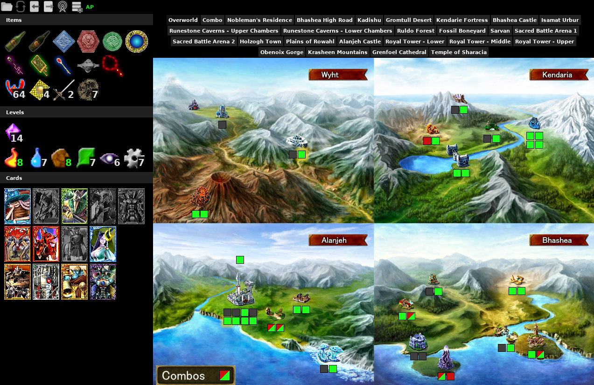
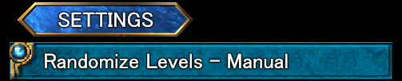
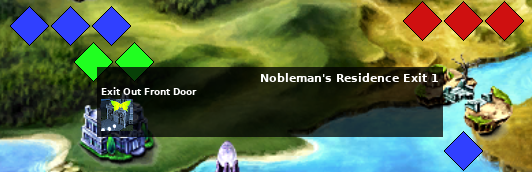
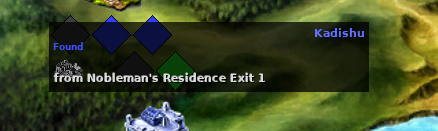

# Lost Kingdoms II AP Tracker

A [PopTracker](https://github.com/black-sliver/PopTracker/) Pack for Lost Kingdoms II to be used for the multiworld randomizer [Archipelago](https://archipelago.gg/). The Lost Kingdoms II AP world can be found at https://github.com/cokeman5/LK2Archipelago.

## Getting Started

Download the most recent .zip file from the **Releases** and either drag it to the PopTracker window or place it in your `poptracker/packs` directory. For more details and instructions on how to connect the tracker to an Archipelago server see [PopTracker](https://github.com/black-sliver/PopTracker/).

## Features

- Automatically reads player options from the AP server slot data.
- Autotracking for found key items and checked locations.
- Automatic and manual tracking for randomized level connections.
- Auto-tabbing of the map tab to display the current level when the player changes levels.
- Displays locations that are reachable in logic (green) and out of logic (yellow).
- Highlighting of hinted item locations.

## Compatibility

| AP World Version | PopTracker Pack Version |
|------------------|-------------------------|
| v0.2.04+         | v1.2.0+                 |
| v0.2.00 - 0.2.03 | v1.1.1                  |
| v0.1.12 - 0.1.13 | v1.0.3                  |
| v0.1.08 - 0.1.11 | v0.6.0                  |
| v0.1.07          | v0.3.0                  |

The AP world is in active development and sometimes changes will break tracking in the PopTracker pack. If you are playing an older version of the AP world, then check the above compatibility table to find the correct version of the PopTracker pack to use. Older versions can be downloaded from the **Releases** on the right.

## Randomized Levels

This pack supports automatic tracking of randomized levels since pack version v0.4.0 and manual tracking since pack version v0.3.0. The pack will automatically identify all level connections when connecting to an AP server. These connections will then control what locations are in logic automatically without any input from the player.

If you wish to see how specific levels connect or want to manually track connections for offline play, then change the pack setting to "Randomize Levels - Manual".

### Manual Instructions (Offline Play)

The "Connections" map tab displays current connections, reachable level exits, and is the place to manually add new connections (only required for offline play). A "connection" is a link between a single exit and a single level to inform the pack's logic that reaching the exit will unlock the connected level. Exits are displayed as color coded diamonds above the level on the map: green if the exit is reachable, red if the exit is unreachable, and grey if it is already connected to a level. Levels are displayed as diamonds below the level on the map: blue if unconnected and grey if connected.

To add a connection, select a level or exit and then select its connected level or exit.

**Steps**:
1. To select a level or exit, hover over the diamond location icon and then left click on the item icon in the hover window.

2. The item icon will update with a yellow butterfly to indicate it is currently selected.
3. With a level or exit already selected, select its connected level or exit to create the connection.

4. Connected locations will update their location color to grey and their item icon will state where they are connected.

Each exit can only be connected to a single level and each level can only be connected to a single exit. To remove a connection, right click on the level or exit item icon for an already connected location. To deselect a level or exit, left click on the selected level or exit.

## Credits

- Pack created with the help of [pack builder](https://github.com/StripesOO7/poptracker-pack-builder).